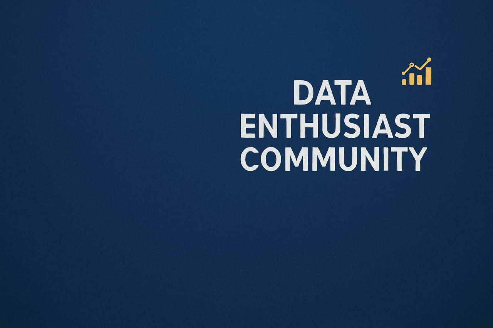

# Data Engineering Zoomcamp — Data Enthusiast Community

  

This repository is used by the **Data Enthusiast Community** as a collaborative workspace to complete the **Data Engineering Zoomcamp** by DataTalks.Club.

The goal of this repo is to:

- Learn data engineering fundamentals through hands-on practice
- Collaborate as a team using Git and GitHub
- Build reproducible, well-structured data pipelines
- Follow industry best practices in data engineering workflows
